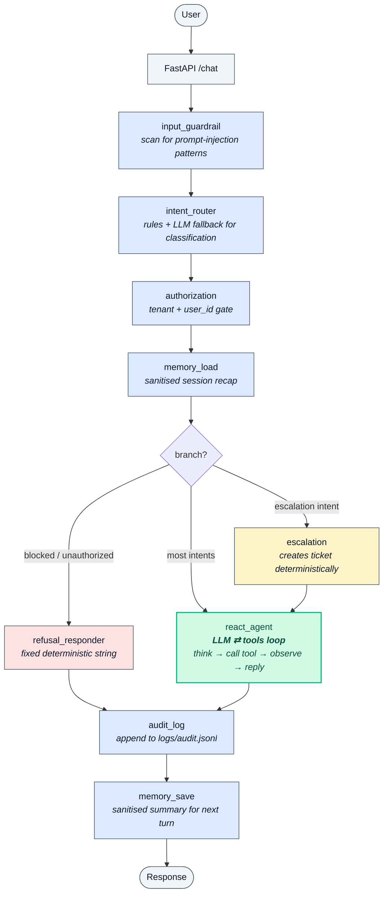
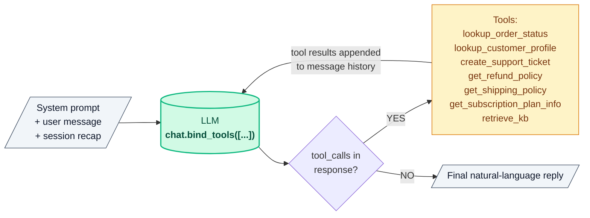

# SupportMate — Architecture Diagrams

> Mermaid source for the SupportMate hybrid architecture diagrams.
> Renders natively on GitHub, dev.to, Hashnode, Notion, Ghost, GitHub Pages,
> and most modern blog platforms.

---

## Full architecture (outer pipeline + ReAct branch)

**Reading the colours:**

* 🟦 **Blue** — deterministic outer pipeline; runs on every request, no LLM autonomy
* 🟩 **Green** — the LLM-driven ReAct loop (the autonomous engine)
* 🟥 **Red** — refusal short-circuit; always a fixed, bounded string
* 🟨 **Yellow** — mixed: deterministic logic then LLM composition

---

## Inside the `react_agent` node — the ReAct loop

The loop runs up to 5 iterations. Each LangChain tool wrapper closes over
the request's `user_id` and `tenant_id`, so the LLM only sees the
user-controllable arguments (e.g. `order_id`, `customer_id`, `query`) and
cannot spoof identity — auth is injected by the outer pipeline.

---

## Who decides what

| Concern                          | Decided by                       |
| -------------------------------- | -------------------------------- |
| Prompt-injection detection       | Outer pipeline (rule-based)      |
| Authorization (user_id, tenant)  | Outer pipeline + tool wrappers   |
| Audit logging                    | Outer pipeline                   |
| Refusal messages                 | Outer pipeline (fixed strings)   |
| **Tool selection and sequence**  | **LLM (inside ReAct)**           |
| **Natural-language response**    | **LLM (inside ReAct)**           |
| Fallback when no LLM configured  | Outer pipeline (templates)       |

This is the production pattern most real agents converge on:
**controlled chassis, autonomous engine.**
